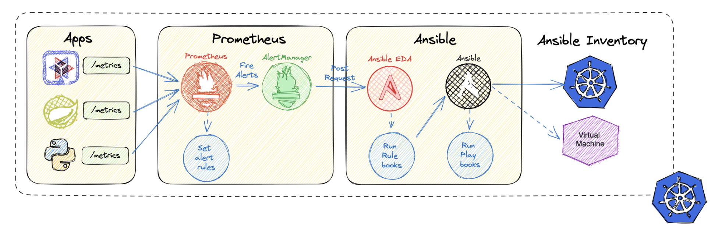
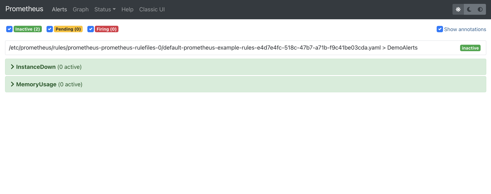

= Ansible AlertManager Demo

This example runs Ansible EDA within a Kubernetes/OpenShift namespace. EDA listens for AlertManager/Prometheus and scales a Deployment automatically in response to alerts.

The _ansible-eda/kubernetes-alertmanager/_ folder contains the https://ansible.readthedocs.io/projects/rulebook/en/stable/rulebooks.html[rulebook], https://docs.ansible.com/ansible/latest/playbook_guide/playbooks.html[playbook(s)], and a _Containerfile_ to package them into the container image that's deployed on OpenShift for this demo.

The _ansible-eda/base-image/_ is used to create a base image with the necessary dependencies that _ansible-eda/kubernetes-alertmanager/_ can use to be built more quickly. 

== Deploy the Demo

This demo assumes you have access to an OpenShift cluster, and you can login
as a user with the `cluster-admin` role assigned.

=== Prometheus Operator Install

To run this demo, first you need the Prometheus Operator installed in the `default` namespace.

In the case of OpenShift, you can install Prometheus into the `default` namespace using *Operator Hub* and searching for "prometheus" and choosing the Red Hat supported version of the Operator. If your cluster has https://docs.openshift.com/container-platform/4.12/monitoring/enabling-monitoring-for-user-defined-projects.html[monitoring enabled for user-defined projects] this step might be unnecessary.

=== Deploying the Demo Components

With operator and up running, deploy all the pieces using https://helm.sh/[Helm].

[source, bash]
----
export TARGET_NAMESPACE=eda-demo

# Create a new project (namespace)
oc new-project $TARGET_NAMESPACE

# Setup the components in your target namespace
helm install ansible-eda-on-kubernetes ./kubernetes-helm/ --namespace $TARGET_NAMESPACE
----

If you change any of the YAML in the _kubernetes-helm/_ directory, you can
apply those changes using:

[source, bash]
----
# Setup the components in your target namespace
helm upgrade ansible-eda-on-kubernetes ./kubernetes-helm/ --namespace $TARGET_NAMESPACE
----

== Viewing the EDA Pod Logs

The next section of the README explains how to trigger the alerts.

Before triggering the alerts, make sure to follow the Ansible EDA logs. Use the
following commands to view EDA Pod logs:

[source, bash]
----
export EDA_POD=$(oc get pod -l 'app.kubernetes.io/name=ansible-eda' -n default -o jsonpath='{.items[0].metadata.name}')

oc logs $EDA_POD -n default -f
----

== Demo Flow

Two alerts are configured by default using a `PrometheusRule` CR in _5-prometheus.yaml_:

* `InstanceDown` - This alert will fire when the number of replicas of the Quarkus application is too low.
* `MemoryUsage` - This alert will fire when the custom `current_memory` metric exposed by the Quarkus application exceeds the defined threshold.

You can view these alerts in the Prometheus UI. Obtain the Prometheus Route details to visit the UI:

[source, bash]
----
oc get route prometheus -n default -o jsonpath='{.spec.host}'
----

Visit the hostname provided by the previous command in your browser. It should look similar to this:

The `InstanceDown` alert can be triggered by scaling the Quarkus deployment down to a single replica:

[source, bash]
----
oc scale --replicas=1 deployment/quarkus-monitor -n default
----

The `MemoryUsage` alert can be triggered by making sure the sum of the `current_memory` metric reported by the Quarkus Pods exceeds the threshold defined in _5-prometheus.yaml_ for more than two minutes. Increase the `current_memory` value 

[source, bash]
----
export QUARKUS_ROUTE=$(oc get route quarkus-monitor -n default -o jsonpath='http://{.spec.host}')

curl $QUARKUS_ROUTE/hello/consume/50
----

Each Pod of the Quarkus application will lower it's `current_memory` value by 1 every 30 seconds, so eventually the alert will stop firing.

